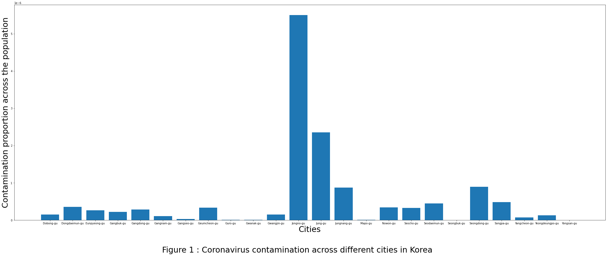
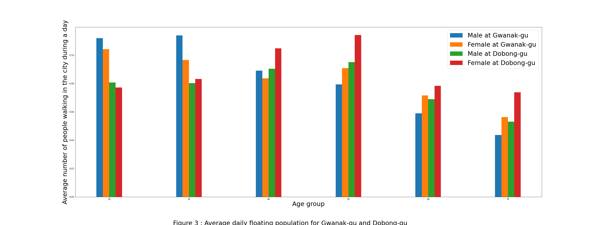

# Project of Data Visualization (COM-480)

| Student's name | SCIPER |
| -------------- | ------ |
|Lucas Eckes|248753|
|Anton Soldatenkov|314433|
|Frédéric Bischoff |263786|

[Milestone 1](#milestone-1-friday-3rd-april-5pm) • [Milestone 2](#milestone-2-friday-1st-may-5pm) • [Milestone 3](#milestone-3-thursday-28th-may-5pm)

## Milestone 1 (Friday 3rd April, 5pm)

**10% of the final grade**
### 1. Dataset
In this project we will work on a korean dataset about COVID-19, these data are published by the KDCC (Korea Center for Disease Control & Prevention) and are actualised every few days on kaggle (https://www.kaggle.com/kimjihoo/coronavirusdataset#PatientInfo.csv). This dataset is particularly exhaustive and contains much more precise information than equivalent dataset published by European countries. For each person infected we have for example his age, his precise localisation, the number of contact persons he has and even a follow-up of his medical state. 

The dataset contains not only the list of persons infected but also the number of persons supposed to be healthy who circulated a given day in each city. As we know that a person can be contaminant before developing any symptom, these data are important in order to see if the spread of the virus is linked to the floating population.

In top of that, some additional data are brought like weather information (temperature, wind, rain, humidity) for each city and some details about the cities themselves (distribution of the elderly population, presence of schools …). 

The data are already clean, so the pre-processing part consists in joining the five main tables together according the representation we want to obtain:
- “Patient_info.csv” for sick people and “Patient_route.csv” for the medical follow up
- “Floating.csv” for floating population,
-“Weather.csv” and “Region.csv” for the descriptive facts about the cities.

For example, in order to observe the impact of the circulation of the population on the spread of the disease, we need to join the table of sick persons with the one of floating population. Or for visualizing a potential impact of meteorological parameters on the propagation, we have to join the count of sick people per day with weather data. 

### 2. Problematic

Coronavirus is the hot topic of the moment and mobilizes the skills of data-scientists like never before, and thus not only for describing the spread of the virus, but also for modelling future and even for helping researchers to develop drugs.

On our scale, by exploiting the diversity of the Korean dataset, we want to provide some visualizations allowing to observe the impact of parameters that have been less analysed so far. Indeed, we would like to provide some representations that shows to what extend the displacement of the population has an impact on the disease propagation, does it propagate faster if an important number of people are circulating? If these persons have an important number of contacts? 

In the same fashion, some important characteristics of a city may also play an important role in the propagation, like the proportion of persons in the elderly or the number of schools? How do these parameters increase or not the spread?

The hypothesis that the weather may have an impact and in particularly the wind is sometimes mentioned. We would like to take benefit of this project, to see if according to the Korean datasetn temperature, humidity or wind may favour contaminations. 

### 3. Exploratory data analysis

The dataset (corona.csv) was cleaned and contain most of the useful datas from [the Kaggle's korean dataset](https://www.kaggle.com/kimjihoo/coronavirusdataset#TimeProvince.csv). It contains several features. The localisation can play a big part on the risk somebody have contracting the virus or not. Since it is a contagious disease, living in a area with an high concentration of people contaminated will cause higher risk of having the disease. There are 24 differents cities in the dataset having different concentration of people contaminated.

The city of Jongno-gu has clearly an higher concentration of contaminated people. It is not so surprising beause Jongno-gu is very touristic and animated city in the center of Seoul. 

Another important parameter is the floating population, it corresponds to the number of people walking in the city during the day collected from users smartphones. A city with a high traffic may propagate the disease faster than in cities with less traffic.

Gangnam-gu is the city with the higher trafic. Again without surprise, Gangnam-gu is the trendy city at the heart of Seoul where it is popular to go out. 

But among cities, there is difference in population's age or sex. And these parameters are of particular interest too. Indeed, coronavirus seem to be more fatal for eldery population. Here, we display the frequency of population groups for two different cities.

The city of Gwanak-gu have an higher proportion of young people comparing to the city of Dobong-gu. Gwanak-gu includes the Seoul National University which made the city particularly young. On the other hand, Dobong-gu is more of a residential and montainous city kind. Another interesting fact is that women are in average older than men in Korea. Are the gender important when dealing with coronavirus ? The count of shools or the proportion of eldery people are included as well in the dataset for the same reasons. 

Others types of features are considered, notably about the weather of the cities. The temperature or wind have perhaps a link for the propagation of the disease. 

Here it seems that there is a positive trend concerning the speed of the wind and the propagation of the coronavirus. But it need some further analysis to conclude any type of correlation.

### 4. Related Work

Since the beginning of the spread of the virus in China in December, a countless number of visualizations have been done on this and similar datasets to observe the number of persons infected all around the world, the number of deaths, or for predicting future cases and the impact of different measures taken by governments. 

What new do we want to offer? We are going to analyze population localisation and movement, as well as weather conditions which seems to be a new and interesting way to go. Our visualisations will be inspired by the John Hopkins University Coronavirus Research Center data (https://coronavirus.jhu.edu/map.html) to give first a general overview of the pandemic. Then, for describing how the virus spreads in a city we will rely on an article by Gevorg Yeghikyan in Towards Data Science (https://towardsdatascience.com/modelling-the-coronavirus-epidemic-spreading-in-a-city-with-python-babd14d82fa2). Sources representing the effect of temperature are much rarer but this link https://www.accuweather.com/en/weather-blogs/weathermatrix/deep-dive-coronavirus-vs-population-and-temperatures/701036 offers a few plots that will help us defining our own graphs. Different small and nice plots about coronavirus are proposed on https://informationisbeautiful.net/visualizations/covid-19-coronavirus-infographic-datapack/, they are another potential source of ideas for realizing some nice and informative visualizations.

## Milestone 2 (Friday 1st May, 5pm)

**10% of the final grade**

## Milestone 3 (Thursday 28th May, 5pm)

**80% of the final grade**

